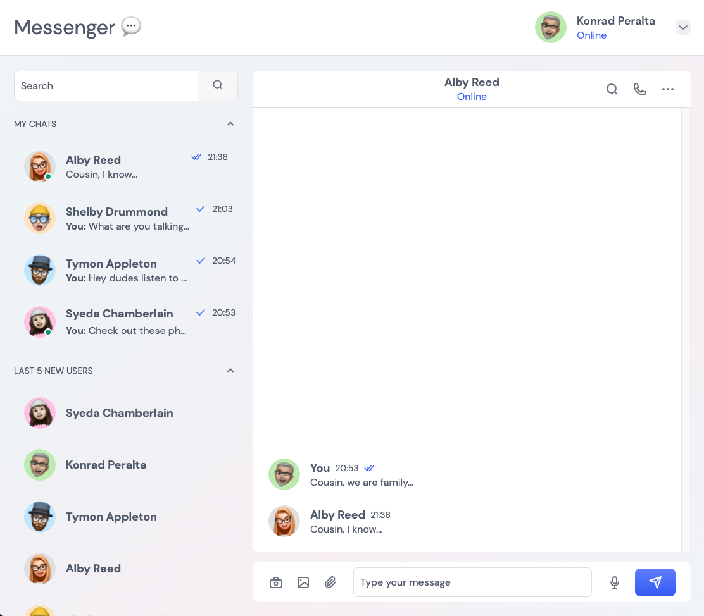
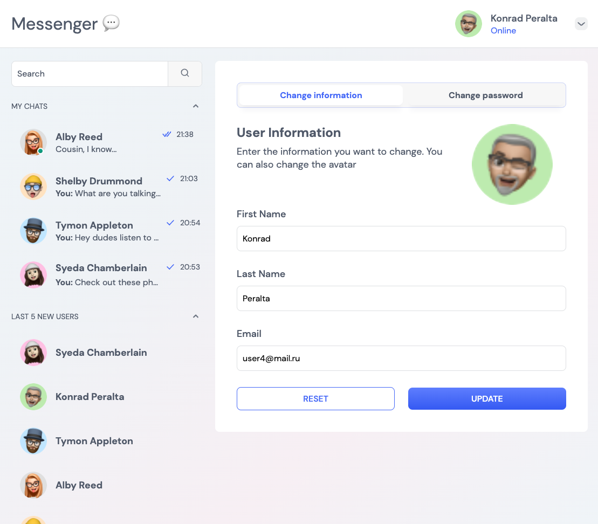
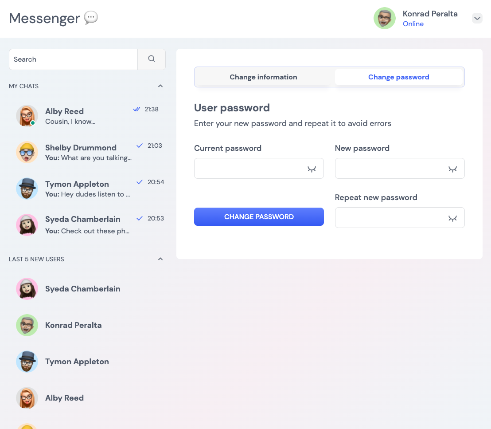
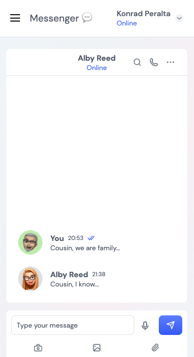
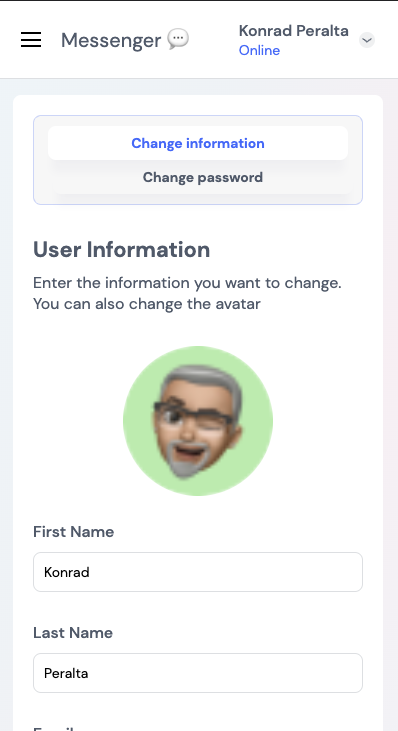
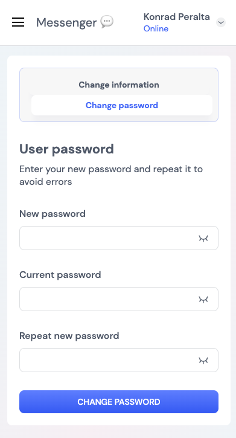

# Messenger
[impeqq.github.io/Messenger](https://impeqq.github.io/Messenger/)
## Table of contents
* [Frontend](#frontend)
* [Backend](#backend)
* [Screenshots](#screenshots)

## Frontend
Frontend is created with:
* JavaScript
* TypeScript
* ReactJS
* GraphQL
* WebSockets

### Setup
For locally launch frontend run 
```
$ yarn
$ yarn start
```
	
## Backend
Backend is created with:
* PostgreSQL
* Docker
* TypeScript
* NodeJS
* NestJS
* GraphQL
* WebSockets

### Setup
For locally launch backend run 
```
$ docker-compose up -d
$ yarn
$ nvm use 12.10.0 (GraphQL upload working in this version)
$ yarn start
```

## Screenshots






